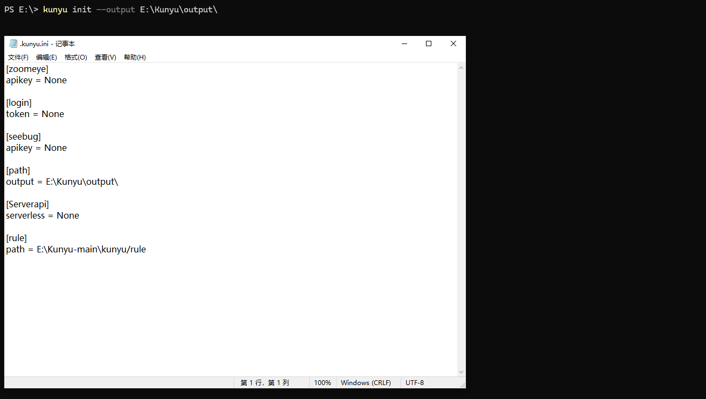
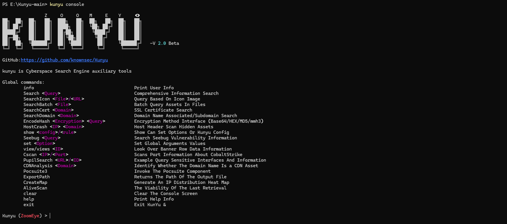
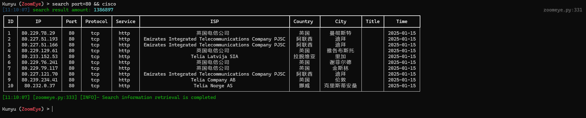
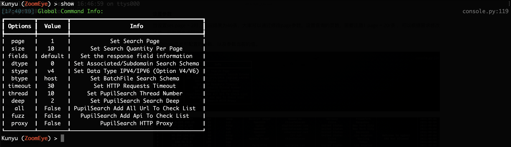

<h1 align="center">Kunyu(坤舆) - More efficient corporate asset collection</h1>

[](https://github.com/knownsec/Kunyu) [](https://github.com/knownsec/Kunyu/issues) [](https://github.com/knownsec/Kunyu/releases) [](https://github.com/wikiZ) [](https://github.com/wikiZ)

--------------
English | [中文文档](./doc/README_CN.md)

# 0x00 Introduce

## Tool introduction

Kunyu (kunyu), whose name is taken from <Knuyu Wanguo Quantu>, is actually a professional subject related to geographic information, which counts the geographic information of the sea, land, and sky. The same applies to cyberspace. The same is true for discovering unknown and fragile assets. It is more like a cyberspace map, which is used to comprehensively describe and display cyberspace assets, various elements of cyberspace and the relationship between elements, as well as cyberspace and real space. The mapping relationship. So I think "Kun Yu" still fits this concept.

Kunyu aims to make corporate asset collection more efficient and enable more security-related practitioners to understand and use cyberspace surveying and mapping technology. 

## Application scenario

For the use of kunyu, there can be many application scenarios, such as:

* Forgotten and isolated assets in the enterprise are identified and added to security management.
* Perform quick investigation and statistics on externally exposed assets of the enterprise.
* Red and blue are used against related requirements, and batch inspections of captured IPs are performed.
* Collect vulnerable assets in batches (0day/1day) for equipment and terminals within the impact.
* Information on sites involved in new-type cybercrime cases is quickly collected and merged for more efficient research, judgment, and analysis.
* Statistic and reproduce the fragile assets on the Internet that are affected by related vulnerabilities.
* .......

# 0x01 Install

**Need Python3 or higher support**

```
git clone https://github.com/knownsec/Kunyu.git
cd Kunyu
pip3 install -r requirements.txt

Linux:
	python3 setup.py install
	kunyu console

Windows:
	cd kunyu
	python3 console.py

PYPI:
	pip3 install kunyu
	
P.S. Windows also supports python3 setup.py install.
```

# 0x02 Configuration instructions
When you run the program for the first time, you can initialize by entering the following command. Other login methods are provided. However, it is recommended to use the API method. Because the user name/password login requires an additional request, the API method is theoretically more efficient. 
```
kunyu init --apikey <your zoomeye key> --seebug <your seebug key>
```


You need to log in with ZoomEye credentials before using this tool for information collection.

ZoomEye access address: https://www.zoomeye.org/

Seebug access address: https://www.seebug.org/

The output file path can be customized by the following command,The default output path is: C:/Users/active user/kunyu/output/  or /active user/kunyu/output

```
kunyu init --output C:\Users\风起\kunyu\output
```



# 0x03 Tool instructions

## Detailed command

```
kunyu console
```


**ZoomEye**

```
Global commands:
        info                                      Print User info
        SearchHost <query>                        Basic Host search
        SearchWeb <query>                         Basic Web search
        SearchIcon <File>/<URL>                   Icon Image search
        SearchBatch <File>                        Batch search Host
        SearchCert <Domain>                       SSL certificate Search
        SearchDomain <Domain>                     Domain name associated/subdomain search
        EncodeHash <encryption> <query>           Encryption method interface 
        HostCrash <IP> <Domain>                   Host Header Scan hidden assets
        Seebug <query>                            Search Seebug vulnerability information
        set <option>                              Set Global arguments values
        view/views <ID>                           Look over http/ssl row data information
        SearchKeyWord                             Query sensitive information by keyword
        Pocsuite3                                 Invoke the pocsuite component
        ExportPath                                Returns the path of the output file
        clear                                     Clear the console screen
        show                                      Show can set options
        help                                      Print Help info
        exit                                      Exit KunYu &
```

**OPTIONS**

```
ZoomEye:
	page <Number>    				The number of pages returned by the query
	dtype <0/1>      				Query associated domain name/subdomain name
	stype <v4/v6>					stype <v4/v6> Set to get data type IPV4 or IPV6
	btype <host/web> 				Set the API interface for batch query
	timeout <num>					Set the timeout period of Kunyu HTTP request
```

## Use case introduction

*Kunyu usage tutorial is as follows * 

**User information query**


**HOST host search**


**Web host search**


**Batch IP search**


**Icon Search**

When collecting corporate assets, we can use this method to retrieve the same ico icon assets, which usually has a good effect when associating related corporate assets. But it should be noted that if some sites also use this ico icon, irrelevant assets may be associated (but people who are bored with other people's ico icons are always in the minority). Support url or local file search. 

**Command format:** 

SearchIocn https://www.baidu.com/favicon.ico 

SearchIcon /root/favicon.ico 


**SSL certificate search**

Query through the serial number of the SSL certificate, so that the associated assets are more accurate, and services that use the same certificate can be searched. When you encounter an https site, you can use this method.


**Multi-factor query**

Similarly, Kunyu also supports multi-factor conditional query related assets, which can be realized through ZoomEye logic operation syntax.


**Feature Search**

Through HTTP request packet features or website-related features, the same framework assets can be concatenated more accurately



**Associated Domain/Subdomain Search**

Search for associated domain names and subdomains, and query associated domain names by default. You can set **associated domain name/subdomain name** two modes by setting the dtype parameter. 

Command format: **SearchDomain Domain** 


**Set the type of data to be obtained**

After the V1.6.1 version, the user can set the data type obtained through the stype parameter to IPV4 or IPV6 to realize the application scenario, and the default parameter is v4.

Command format: **set stype = v6**


**View Banner Information** 

The user can view the banner corresponding to the specified serial number through the view command, so as to further analyze the front-end code and Header header, and the user can intercept the banner information for further association matching. 

Command format: **view ID** 


The user can also view the SSL certificate information of the specified serial number through the views command, and further associate it by extracting the sensitive information in the SLL certificate information.

Command format: **views ID**


**Collection of Sensitive Information** 

After Kunyu v1.6.0, the acquisition of sensitive information in the banner has been added. Normally use the relevant grammar and set the number of pages. Kunyu will automatically collect the sensitive data in the banner information of the last query result, and then use the SearchKeyWord command to view the result . **Currently, testing will continue to focus on this feature point**. 


**System command execution** 

After Kunyu v1.6.0, support for the execution of system commands has been added. You can debug surveying and mapping data more conveniently and effectively by executing some commonly used system commands. For a list of specific executable commands, see Article 11 in the Issue of the README file. 

**Example One** 


**Example two **


**Encoding hash calculation**

In some scenarios, you can use this command to perform common HASH encryption/encoding, such as BASE64, MD5, mmh3, HEX encoding, and debug in this way.

**Command format:** 

EncodeHash hex 7239dcc9beb5c9cd795415f9
EncodeHash md5 https://www.baidu.com/favicon.ico
EncodeHash md5 /root/favicon.ico
EncodeHash mmh3 https://www.baidu.com/favicon.ico
EncodeHash mmh3 /root/favicon.ico
EncodeHash base64 dasdasdsa


**Seebug vulnerability query**

You can query historical related vulnerabilities by entering information about the framework and equipment you want to find, but you need to note that only English is supported, and improvements and upgrades will be made later.

Command format: **Seebug tongda** 


**Setting parameters**

When set page = 2, the returned results are 40. You can modify the page parameter to set the number of pages to be queried. Note that 1 page = 20/items. You can modify the value according to your needs to get more returned results. 

The configurable parameters and the current values of the parameters are displayed through show. 




**Pocsuite linkage**

In versions after v1.3.1, you can use kunyu to link the console mode of pocsuite3 for integrated use.


**HOSTS head collision**

Through HOSTS collision, the hidden assets in the intranet can be effectively collided. According to the ServerName domain name and IP configured in the middleware httpf.conf, the access can be directly connected to the intranet business system! Follow-up by setting the local hosts file to achieve local DNS resolution, because the priority of the local hosts file is higher than the DNS server resolution. Support reverse check through ZoomEye domain name library or read TXT file to get the list of domain names. 

**Command format:** 

HostCrash C:\ip.txt C:\host.txt 

HostCrash C:\ip.txt baidu.com 

HostCrash 1.1.1.1 baidu.com 

HostCrash 1.1.1.1 G:\host.txt 

**Example One** 


**Example Two** 


**Serverless HostCrash Scan**

Kunyu v1.6.2 adds an interesting feature that combines the cloud function to perform HOSTS collisions on the target. In this way, our scanned IP is effectively hidden to prevent it from being captured by the target situational awareness, and it also prevents WAF from banning the real IP. , And conceal the features. Through the following scanning effect, it can be found that the scanned IPs are all cloud service vendors and each scan is a random IP address. You can choose whether to enable it by configuring the cloud function address during initialization.

**Configuration Guide:** [Configuration Method of Cloud Function](./doc/Serverless_EN.md)

**Related technology:**https://www.anquanke.com/post/id/261551

**Situational Awareness Scanning Effect:**


**Asset distribution map**

v1.6.2 adds the CreateMap command, which can generate a geographic location distribution map for the assets retrieved last time, and more vividly describe the mapping relationship between network space and real space. It is located in the same output directory as Excel, and the generated asset map is the same as the last time. The number of search results is related.

**Generate distribution map**


**Web page**


**Data result**

All search results are saved in the user's root directory, and the directory is created based on the current timestamp. All query results of a single start are stored in an Excel format under one directory, giving a more intuitive experience. The output path can be returned through the ExportPath command.


# 0x04 Loading

​    In fact, there are still many ideas, but as an Alpha version, this is the case, and it will continue to be improved in the later period. I hope that Kunyu can be known to more security practitioners. Thank you for your support.

​    The tool framework has reference to Kunlun Mirror and Pocsuite3, which are all very good works.

​	About the developer Fengqi(风起) Related articles: https://www.anquanke.com/member.html?memberId=148652 

​    Thanks to all the friends of KnownSec 404 Team.

> "Seeing clearly" is a manifestation of ability, a "tool", and "visible" is a manifestation of thought, and the final link is "Dao." 
>
> ​																																							 	   --SuperHei

# 0x05 Issue

**1、Multi-factor search**

ZoomEye search can use multi-factor search, dork:cisco +port:80 (note the space) can search all data that meet the conditions of cisco and port:80, if there is no space in between, it is the same search condition, it is that cisco is satisfied and the port is All data for 80. Kunyu's dork does not require quotation marks.

**2、High-precision geographical location**

ZoomEye gives privileged users high-precision geographic location data, but it should be noted that ordinary users do not have this function, so I hope you know.

**3、Username/password login**

If you use username/password as the initialization condition, the token will be valid for 12 hours. If you find that your search cannot return data, you may wish to info. If the session times out, the initialization command prompt will be returned. In most cases, we recommend that you use the API KEY method, there is no invalidation problem. This design is also for the security of your account and password. After all, the API KEY can be reset and the token will become invalid. However, with the account and password, it is possible to log in to your ZoomEye account.

**4、Cert certificate search**

It should be noted that, according to the normal logic, you need to encode the serial number of the target SSL certificate in hexadecimal to match the sentence search, but Kunyu only needs to provide the Domain address to search. The principle is to make a request to the target station to obtain the serial number and process it, but if your host cannot access the target that needs to be searched, it cannot be retrieved. At this time, you can also search with the sentence in the usual way.

**5、Favicon icon search**

ico icon search not only supports URL retrieval, but also supports local ico icon file search, which has better scalability and compatibility.

**6、Query data save path**

By default, your query data is in the Kunyu folder under the user directory. You can also use the ExportPath command to query the path in the console mode.

**7、Autocomplete**

Kunyu's auto-completion supports upper and lower case, command logging, etc., use Tab to complete, please refer to Metasploit for usage.

**8. Regarding the error when using pip install kunyu**

The following error was reported when using pip install kunyu:
`File "C:\Users\风起\AppData\Local\Programs\Python\Python37\Scripts\kunyu-script.py", line 1 SyntaxError: Non-UTF-8 code starting with'\xb7' in file C: \Users\风起\AppData\Local\Programs\Python\Python37\Scripts\kunyu-script.py on line 1, but no encoding declared; see http://python.org/dev/peps/pep-0263/ for details`

**solution:**
Modify the C:\Users\风起\AppData\Local\Programs\Python\Python37\Scripts\kunyu-script.py file and add # encoding: utf-8 at the beginning of the file.

Then save it and you can use it normally. The bug appears because there is a Chinese name in the user's directory path, which usually appears on windows.

**9. Pocsuite3 module POC storage directory**

When using the pocsuite3 module, if you want to add a new POC module, you can add a POC file in **project directory/pocsuite3/pocs/**. It should be noted that when using the packaged Kunyu console command, you should add the POC to this directory, and repackage the Kunyu program to load the POC normally. 

**10. Pocsuite3 module POC missing issue**

When using the Pocsuite command linkage, if it is a packaged Kunyu version, the poc has been fixed. At this time, modifying the poc directory cannot add new modules. At this time, you can repackage it or use the **project directory/kunyu /console.py** Run kunyu to update the poc module in real time. 

**11. Kunyu can execute system commands as follows. ** 

**Windows:**
        OS_SYSTEM = [**"ipconfig", "dir", "whoami", "ping", "telnet", "cd", "findstr", "chdir","find", "mysql", "type", "curl", "netstat", "tasklist", "taskkill", "tracert", "del", "ver","nmap"]**

**Linux/Mac：**

​	OS_SYSTEM = [**"ifconfig", "ls", "cat", "pwd", "whoami", "ping", "find", "grep", "telnet", "mysql", "cd", "vi", "more", "less", "curl", "ps", "netstat", "rm", "touch", "mkdir", "uname","nmap"]**

**12, Kunyu operating environment** 

It is recommended to use Python3.2-3.9 version, other versions of Python3 may have unknown errors, **Python2 cannot be used**. 

**13、Set the timeout period **

**If the HTTP request is not responded in time, it can be solved by increasing the timeout time, such as: set timeout = 50 **

# 0x06 Contributions

[风起@knownsec 404](https://github.com/wikiZ)  
[wh0am1i@knownsec 404](https://github.com/wh0am1i)  
[fenix@knownsec 404](https://github.com/13ph03nix)  
[0x7F@knownsec 404](https://github.com/0x7Fancy)

# 0x07 Events

 **WHC 2021 (补天白帽大会) Best Weapon of the Year Award **

 **KCON 2021 Arsenal**

## 404Starlink


Kunyu has joined [404Starlink](https://github.com/knownsec/404StarLink)


# 0x08 Community

If you have any questions, you can submit an issue under the project, or contact us through the following methods.

1、Scan the Wechat QR code to add ZoomEye operation Wechat, and comment on Kunyu, which will draw everyone to the ZoomEye Cyberspace Surveying and Mapping Exchange Group for communication. 


