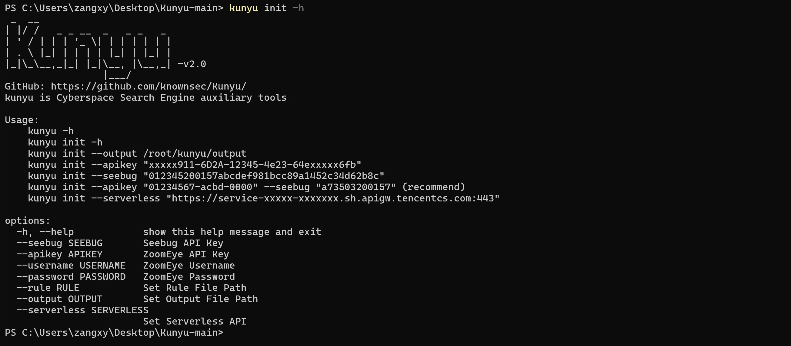
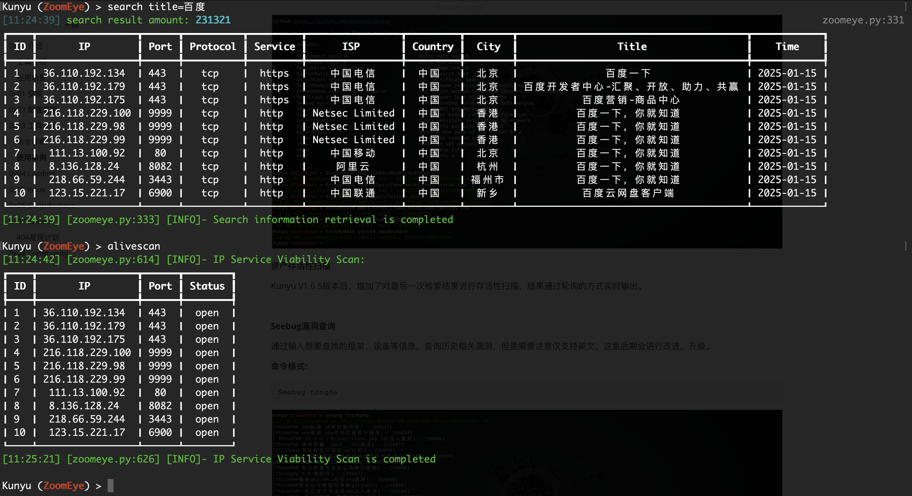

<h1 align="center">Kunyu(坤舆) - 更高效的企业资产收集</h1>

[](https://github.com/knownsec/Kunyu) [ ](https://github.com/knownsec/Kunyu/releases) [](https://github.com/wikiZ) [](https://github.com/wikiZ)

------

中文文档 | [English](../README.md)


# 0x00 介绍

## 工具介绍

Kunyu (坤舆)，名字取自 <坤舆万国全图> ，测绘实际上是一个地理信息相关的专业学科，针对海里的、陆地的、天上的地理信息进行盘点。同样应用于网络空间，发现未知、脆弱的资产也是如此，更像是一张网络空间地图，用来全面描述和展示网络空间资产、网络空间各要素及要素之间关系，以及网络空间和现实空间的映射关系。所以我认为“坤舆”还是比较贴合这个概念的。

Kunyu(坤舆)，旨在让企业资产收集更高效，使更多安全相关从业者了解、使用网络空间测绘技术。

## 应用场景

对于 kunyu 的使用，应用场景可以有很多，例如：

* 企业内遗忘的，孤立的资产进行识别并加入安全管理。 
* 企业外部暴露资产进行快速排查，统计。
* 红蓝对抗相关需求使用，对捕获IP进行批量检查。
* 批量收集脆弱资产(0day/1day) 影响内的设备、终端。
* 新型网络犯罪涉案站点信息进行快速收集，合并，进行更高效的研判、分析。
* 对互联网上受相关漏洞影响的脆弱资产，进行统计、复现。
* .......

# 0x01 安装

**需要Python3以上的支持**

```
git clone https://github.com/knownsec/Kunyu.git
cd Kunyu
pip3 install -r requirements.txt

Linux:
	python3 setup.py install
	kunyu console

Windows:
	cd kunyu
	python3 console.py

PYPI:
	pip3 install kunyu
	
P.S. Windows同样支持python3 setup.py install
```

# 0x02 配置说明
在第一次运行程序时通过输入以下命令进行初始化操作，提供了其他登录方式，但是推荐使用API的方式，因为用户名/密码登录需要额外做一次请求，所以理论上API的方式会更加高效。
```
kunyu init --apikey <your zoomeye key> --seebug <your seebug key>
```


初次使用需要通过ZoomEye登录凭证，才使用该工具进行信息收集，目前ZoomEye注册用户每月赠送1w条查询额度，足够日常工作使用。

**ZoomEye访问地址：https://www.zoomeye.org/**

**Seebug访问地址：https://www.seebug.org/**

可以通过以下命令自定义输出文件路径 ，默认输出路径为:C:\Users\active user\kunyu\output\

```bash
kunyu init --output C:\Users\风起\kunyu\output
```


# 0x03 工具使用

## 命令详解

```
kunyu console
```


**Kunyu Command**

```
Global commands:
        info                                      Print User Info
        Search <Query>                            Comprehensive Information Search
        SearchIcon <File>/<URL>                   Query Based On Icon Image
        SearchBatch <File>                        Batch Query Assets In Files
        SearchCert <Domain>                       SSL Certificate Search
        SearchDomain <Domain>                     Domain Name Associated/Subdomain Search
        EncodeHash <Encryption> <Query>           Encryption Method Interface (Base64/HEX/MD5/mmh3)
        HostCrash <IP> <Domain>                   Host Header Scan Hidden Assets
        show <config>/<rule>                      Show Can Set Options Or Kunyu Config
        Seebug <Query>                            Search Seebug Vulnerability Information
        set <Option>                              Set Global Arguments Values
        view/views <ID>                           Look Over Banner Row Data Information
        Cscan <IP>/<Port>                         Scans Port Information About CobaltStrike
        PupilSearch <URL>/<ID>                    Example Query Sensitive Interfaces And Information
        CDNAnalysis <Domain>                      Identify Whether The Domain Name Is a CDN Asset
        Pocsuite3                                 Invoke The Pocsuite Component
        ExportPath                                Returns The Path Of The Output File
        CreateMap                                 Generate An IP Distribution Heat Map
        AliveScan                                 The Viability Of The Last Retrieval
        clear                                     Clear The Console Screen
        help                                      Print Help Info
        exit                                      Exit KunYu & 
```

**OPTIONS**

```
ZoomEye:
        page <Number>       		查询返回页数(默认查询一页)
        size <Number>      		设置每页搜索数量(默认值为每页查询10条)
        fields <fields>     		设置响应字段信息，具体以readme给出字段为准
        dtype <0/1>         		查询关联域名/子域名(设置0为查询关联域名，反之为子域名)
        stype <v4/v6>       		设置获取数据类型IPV4或IPV6，默认为 ipv4,ipv6 全选
        btype <host/web>    		设置批量查询的API接口(默认为HOST)
        timeout <num>       		设置Kunyu HTTP请求的超时时间
        thread              		设置PupilSearch线程数量(默认为10)
        deep                		设置PupilSearch递归深度(默认为2)
        all                 		PupilSearch Add All Url To Check List
        fuzz                		PupilSearch Add Api To Check List
        proxy               		PupilSearch HTTP Proxy
```

## 使用案例

*Kunyu（坤舆）的使用教程如下所示*

**用户信息**


**综合搜索（NEW）**


**自定义输出字段（NEW）**

具体支持输出自定义字段可参考以下：

| 字段名称           | 类型    | 描述                                 | 权限             |
| ------------------ | ------- | ------------------------------------ | ---------------- |
| ip                 | string  | IP 地址（web 资产时不完整时使用）    | 所有用户         |
| domain             | string  | 域名                                 | 所有用户         |
| url                | string  | 资产的完整 URL（用于 web 资产）      | 所有用户         |
| ssl.jarm           | string  | SSL JARM 指纹                        | 所有用户         |
| ssl.ja3s           | string  | SSL JA3S 指纹                        | 所有用户         |
| iconhash_md5       | string  | icon 图像的 MD5 值                   | 专业版及以上用户 |
| robots_md5         | string  | robots.txt 文件的 MD5 值             | 商业版及以上用户 |
| security_md5       | string  | 安全设置文件的 MD5 值                | 商业版及以上用户 |
| hostname           | string  | 主机名信息                           | 所有用户         |
| os                 | string  | 操作系统信息                         | 所有用户         |
| port               | integer | 端口号                               | 所有用户         |
| service            | string  | 提供的应用协议（例如 HTTP、SSH）     | 所有用户         |
| title              | list    | 网页标题                             | 所有用户         |
| version            | string  | 组件版本信息                         | 所有用户         |
| device             | string  | 设备名称                             | 所有用户         |
| rdns               | string  | 反向 DNS 信息                        | 所有用户         |
| product            | string  | 产品组件信息                         | 所有用户         |
| header             | string  | HTTP 响应头信息                      | 所有用户         |
| header_hash        | string  | 从 HTTP 响应头计算的哈希值           | 专业版及以上用户 |
| banner             | string  | 服务横幅信息                         | 所有用户         |
| body               | string  | HTML 正文内容                        | 商业版及以上用户 |
| body_hash          | string  | 从 HTML 正文计算的哈希值             | 专业版及以上用户 |
| update_time        | string  | 资产更新时间                         | 所有用户         |
| header.server.name | string  | HTTP 响应头中的 server 名称          | 所有用户         |
| continent.name     | string  | 所在大洲名称                         | 所有用户         |
| country.name       | string  | 所在国家名称                         | 所有用户         |
| province.name      | string  | 所在省份名称                         | 所有用户         |
| city.name          | string  | 所在城市名称                         | 所有用户         |
| isp.name           | string  | ISP 名称                             | 所有用户         |
| organization.name  | string  | 组织信息名称                         | 所有用户         |
| zipcode            | integer | 邮政编码                             | 所有用户         |
| idc                | string  | 是否为 IDC（0 表示否，1 表示是）     | 所有用户         |
| lon                | string  | 地理位置经度                         | 所有用户         |
| lat                | string  | 地理位置纬度                         | 所有用户         |
| asn                | string  | 自治系统编号                         | 所有用户         |
| protocol           | string  | 传输层协议（例如 TCP、UDP）          | 所有用户         |
| honeypot           | integer | 是否为蜜罐（0 表示否，1 表示是）     | 所有用户         |
| ssl                | string  | SSL x509 证书信息                    | 所有用户         |
| primary_industry   | string  | 主行业信息                           | 商业版及以上用户 |
| sub_industry       | string  | 子行业信息                           | 商业版及以上用户 |
| rank               | integer | 资产重要性排名，分值越大重要性越高。 | 商业版及以上用户 |

**设置更改默认输出字段**

```
Set fields = ip,port
```


**批量 IP 搜索**


**Icon 搜索**

在搜集企业资产时，我们可以使用这样的方式进行检索相同 ico 图标资产，在关联相关企业资产时，通常会有不错的效果。但是需要注意的是如果某些站点也使用这个 ico 图标，可能会关联出无关资产(但是无聊用别人 ico 图标的人总归是少数吧)。支持url或本地文件的方式搜索。

**命令格式：**

```
SearchIocn https://www.baidu.com/favicon.ico
SearchIcon /root/favicon.ico
```


**SSL证书搜索**

通过 SSL 证书的序列号进行查询，这样关联出来的资产较为精准，能搜索出使用相同证书的服务。碰到https站点时，可以通过这样的方式。


**特征搜索**

通过HTTP请求包特征或网站相关特征可以进行更加精准的串并相同框架资产


**多因素查询**

同样kunyu也支持多因素条件查询关联资产，可以通过ZoomEye逻辑运算语法实现。


**关联域名/子域名搜索**

对关联域名以及子域名进行搜索，默认查询关联域名，可以通过设置 dtype 参数设置 **关联域名/子域名** 两种模式。

命令格式：**SearchDomain Domain**


**设置获取数据类型**

在V1.6.1版本后，用户可以通过stype参数设置获取的数据类型为IPV4或者IPV6，实现应用场景，默认参数为v4。

命令格式：**set stype = v6**


**查看Banner信息**

用户可以通过view命令查看指定序号对应信息的Banner，从而进一步分析前端代码及Header头，用户可以截取banner信息进一步的关联匹配。

命令格式: **view ID**


用户也可以通过views命令查看指定序号的SSL证书信息，通过提取SLL证书信息中的敏感信息进一步关联。

命令格式：**views ID**


**Cscan扫描cobaltStrike的端口信息**  

Cscan是Kunyu 1.7.2版本的一个新特性，允许您使用此命令来识别网络资产是否为cobaltStrike，并列举配置文件的详细信息。  

**命令格式:**

```
Cscan 1.1.1.1 443  
Cscan 1.1.1.1 443, 80  
```


**CDNAnalysis（NEW）**

**命令格式：**

```
CDNAnalysis --file ip.txt
CDNAnalysis --domain www.baidu.com
```


**PupilSearch敏感信息收集**

在Kunyu v1.7.0版本后，移除了KeyWord命令替换为PupilSearch，就是提取敏感数据的功能，当然也支持通过空间测绘提取历史banner信息，举个例子像accesskey这种，历史数据中banner泄露了敏感信息，哪怕现在换了服务，但是AK/SK没有过期，依旧可以直接利用，懂得都懂，支持提取敏感信息**（身份证号、IP、JWT、API接口、appid、appkey、GithubAccessKey，default username\password、邮箱等）**。

**命令格式：**

```
PupilSearch https://www.domain.com/
PupilSearch ID(通过Kunyu返回的ID提取敏感信息)
```


**系统命令执行**

在Kunyu v1.6.0后增加了对系统命令执行的支持，可以通过执行常用的一些系统命令进行更方便有效的调试测绘数据，具体可执行命令列表可见README文件Issue中第11条。

**示例一**


**示例二**


**编码哈希计算**

在一些场景下，可以通过该命令进行常用的HASH加密/编码，如：BASE64、MD5、mmh3、HEX编码，通过这种方式进行调试。

**命令格式：**

```
EncodeHash hex 7239dcc9beb5c9cd795415f9
EncodeHash md5 https://www.baidu.com/favicon.ico
EncodeHash md5 /root/favicon.ico
EncodeHash mmh3 https://www.baidu.com/favicon.ico
EncodeHash mmh3 /root/favicon.ico
EncodeHash base64 dasdasdsa
```


**资产存活性扫描**

Kunyu V1.6.5版本后，增加了对最后一次检索结果进行存活性扫描，结果通过轮询的方式实时输出。



**Seebug漏洞查询**

通过输入想要查找的框架、设备等信息，查询历史相关漏洞，但是需要注意仅支持英文，这里后期会进行改进，升级。

**命令格式:** 

```
Seebug tongda
```


**加载指纹文件**

Kunyu V1.6.4版本新增了加载外部指纹库的功能，Kunyu默认提供了5条指纹文件作为参考，用户可以编写自己的指纹文件进行加载或分享使用，更加灵活的进行检索，方便在溯源、安全研究、红队攻防中资源共享，增强团队协作。

可以通过**show rule**命令查看当前加载指纹库的信息。


默认读取指纹文件目录是在**项目目录/kunyu/rule**下，可以通过**kunyu init --rule C:\风起\rule**进行自定义读取指纹文件路径的设置。

可以使用**show config**命令查看kunyu配置文件的信息。


在面对复杂的指纹信息时，可以通过**项目目录/kunyu/createrule.py**生成yaml文件


yaml指纹文件格式如下，需要注意要严格按照下面标准格式，不能缺少字段。

```bash
KXID: kx-2022-07
author: 风起
createDate: 2022-1-4
description: 查找公网部署的ngrok反向代理
kx_name: ngrok代理工具指纹
kx_query: '''Server: beegoServer:1.12.0'' +''<a href="/login/index">Found</a>.'''
source: https://github.com/wikiZ/Kunyu
```

**设置参数**

当设置set page = 2时，返回结果为20条，大家可以通过修改page参数，设置查询的页数，需要注意1 page = 10/条 ，可以根据需求修改该值，获取更多返回结果。

**Kunyu2.0可以通过size设置每页查询数量，默认是10条，最大是10,000条/页。**

通过show显示可配置的参数，以及参数当前的值。


**Pocsuite3 联动**

在v1.3.1之后的版本中，您可以使用kunyu进行联动pocsuite3的console模式进行一体化的使用。


**HOSTS头碰撞**

通过HOSTS碰撞，可以有效的碰撞出内网中隐藏的资产，根据中间件httpf.conf中配置的ServerName域名和IP捆绑访问即可直通内网业务系统！后续通过设置本地hosts文件实现本地DNS解析，因为本地hosts文件优先级高于DNS服务器解析。支持通过ZoomEye域名库反查或者读取TXT文件获取域名列表。

**命令格式：**

```
HostCrash C:\ip.txt C:\host.txt
HostCrash C:\ip.txt baidu.com
HostCrash 1.1.1.1 baidu.com
HostCrash 1.1.1.1 G:\host.txt
```

**示例一**


**示例二**


**Serverless HostCrash Scan**

Kunyu v1.6.2新增了一个有意思的功能，结合云函数对目标进行HOSTS碰撞，通过这样的方式有效的隐藏了我们的扫描IP防止被目标态势感知捕捉到，也防止了WAF对真实IP的封禁，并对特征进行了隐匿，通过下面的扫描效果可以发现扫描的IP均为云服务厂商且每次扫描均为随机IP地址，可以通过初始化时配置云函数地址的方式自主选择是否启用。

**配置导读：** [云函数的配置方法](./Serverless_CN.md)

**相关技术：**https://www.anquanke.com/post/id/261551

**态势感知扫描效果：**


**资产分布地图**

v1.6.2新增CreateMap命令，可对上次检索的资产生成地理位置分布图，更形象的描述网络空间和现实空间的映射关系，与Excel位于相同的输出目录下，生成的资产图与上次搜索结果的条数相关。

**生成分布图**


**Web页面**


**数据结果**

搜索的所有结果都保存在用户根目录下，并根据当前时间戳创建目录。单次启动的所有查询结果都在一个目录下，保存为Excel格式，给予更加直观的体验。可以通过ExportPath命令返回输出路径。


# 0x04 Loading

​    感谢各位用户的支持，Kunyu也会坚持进行完善更新的，希望 Kunyu (坤舆)能够让更多安全从业者所知，工具框架有参考昆仑镜、Pocsuite3，都是非常棒的作品。	

​    感谢 KnownSec 404 Team 的全体小伙伴。	

​	**关于开发者 风起 相关文章：https://www.anquanke.com/member.html?memberId=148652**																																																	

> “ 看得清 ” 是能力的体现，是 “ 器 ” ，而 “ 看得见 ” 就是思想的体现，那最后关联的是 “ 道 ”	——SuperHei（黑哥）																																				
>

# 0x05 Issue

**1、多因素搜索**

ZoomEye搜索可以使用多因素搜索，dork：cisco +port:80(注意空格) 可以搜索符合cisco以及port:80条件的所有数据，如果没有中间的空格则为同一搜索条件，则为满足cisco并且端口为80的所有数据。Kunyu的dork无需引号，**2.0新版语法有所改变。**

**2、高精地理位置**

ZoomEye给予特权用户高精地理位置的数据，但是需要注意的是普通用户，则不具备该功能，望周知。

**3、用户名/密码登录**

如果您使用的是username/password作为初始化条件，那么所获得token时效为12小时，如果发现您的搜索不能返回数据，那么不妨info一下，如果会话超时则会返回初始化命令提示。绝大多数情况下我们建议您使用API KEY的方式，则不存在失效问题。这样的设计也是为了您账号密码的安全性，毕竟API KEY可以重置，token会失效，但是有了账号密码，则有可能登录您的ZoomEye账户。

**4、Cert证书搜索**

需要注意的是，按照常规逻辑，您需要将目标ssl证书的序列号进行十六进制编码后才能配合语句搜索，但是Kunyu则仅需要提供Domain地址则可以检索。原理是对目标站做了一次请求获取到了序列号并进行处理，但是如果您的主机无法访问需要搜索的目标则无法检索，这时您也可以按照常规方法配合语句搜索。

**5、Favicon图标搜索**

ico图标搜索既支持URL检索，又支持本地ico图标文件搜索，这样有了更好的延展性，以及兼容性。

**6、查询数据保存路径**

默认情况下您的查询数据在用户目录下的Kunyu文件夹中，您也可以在console模式中使用ExportPath命令查询路径。

**7、自动补全**

Kunyu的自动补全支持大小写，命令记录等，使用Tab进行补全，用法参见Metasploit即可。

**8、关于pip install kunyu使用时报错的问题**

在使用pip install kunyu时报以下错误：
`File "C:\Users\风起\AppData\Local\Programs\Python\Python37\Scripts\kunyu-script.py", line 1 SyntaxError: Non-UTF-8 code starting with '\xb7' in file C:\Users\风起\AppData\Local\Programs\Python\Python37\Scripts\kunyu-script.py on line 1, but no encoding declared; see http://python.org/dev/peps/pep-0263/ for details`

解决方案：
修改C:\Users\风起\AppData\Local\Programs\Python\Python37\Scripts\kunyu-script.py文件，在文件开头添加# encoding: utf-8
然后保存即可正常使用，该bug出现原因为用户目录路径存在中文名，通常出现在windows上。

**9、Pocsuite3模块POC存放目录**

对于使用pocsuite3模块时，如果想要新增POC模块，则可以在 **项目目录/pocsuite3/pocs/** 添加POC文件。需要注意的是，当使用打包好的Kunyu console命令时应添加POC到该目录，并重新打包kunyu程序才可以正常加载POC。

**10、Pocsuite3模块POC缺失问题**

使用Pocsuite命令联动时，如果是已经打包好的Kunyu版本，则poc已经被固定，这时修改poc目录是无法新增模块的，这时可以通过重新打包的方式，或者使用 **项目目录/kunyu/console.py** 运行kunyu可实时更新poc模块。

**11、Kunyu可执行系统命令如下。**

**Windows:**
        OS_SYSTEM = [**"ipconfig", "dir", "whoami", "ping", "telnet", "cd", "findstr", "chdir","find", "mysql", "type", "curl", "netstat", "tasklist", "taskkill", "tracert", "del", "ver","nmap","ls"**]

**Linux/Mac：**

​	OS_SYSTEM = [**"ifconfig", "ls", "cat", "pwd", "whoami", "ping", "find", "grep", "telnet", "mysql", "cd", "vi", "more", "less", "curl", "ps", "netstat", "rm", "touch", "mkdir", "uname","nmap"**]

**12、Kunyu运行环境**

这里建议使用Python3.2 — 3.12版本，Python3其他版本可能会有未知的报错，**Python2不可使用**。

**13、设置超时时间**

如果HTTP请求没有得到及时响应，可以通过增大timeout时间解决，如:set timeout = 50

**14、Kunyu客户端启动时间较长**

由于Kunyu2.0中会在初始化阶段进行识别使用国内外接口，所以可能需要一点时间才能启动使用，时间在5-10秒。

**15、RULE指纹存放位置**

RULE指纹存放位置可以在～/.kunyu.ini下进行配置修改，默认在编译运行的kunyu路径下。

**16、View功能无法使用**

view功能在ZoomEye更新中，需要商务版会员才能正常使用，views功能不受影响。

**17、异常BUG**

由于测试环境为MAC OS所以在其他操作系统中可能存在不兼容的问题，希望及时反馈ISSUE或联系运营。

**18、杀毒软件查杀**

Kunyu可能会因为杀毒软件查杀文件导致无法启动，注意此问题

**19、还没想好 ^_^**

# 0x06 Contributions

[风起@knownsec 404](https://github.com/wikiZ) 

 [wh0am1i@knownsec 404](https://github.com/wh0am1i)  
[fenix@knownsec 404](https://github.com/13ph03nix)  
[0x7F@knownsec 404](https://github.com/0x7Fancy)

# 0x07 Events

 **WHC 2021 (补天白帽大会) 年度最佳兵器奖**

 **KCON 2021 Arsenal**

## 404星链计划


Kunyu 现已加入 [404星链计划](https://github.com/knownsec/404StarLink)


# 0x08 Community

如果有问题可以在项目下提交issue，或通过以下方式联系我们。

1、扫描一下微信二维码添加ZoomEye运营微信，并备注坤舆，会把大家拉到ZoomEye网空测绘交流群中交流。


