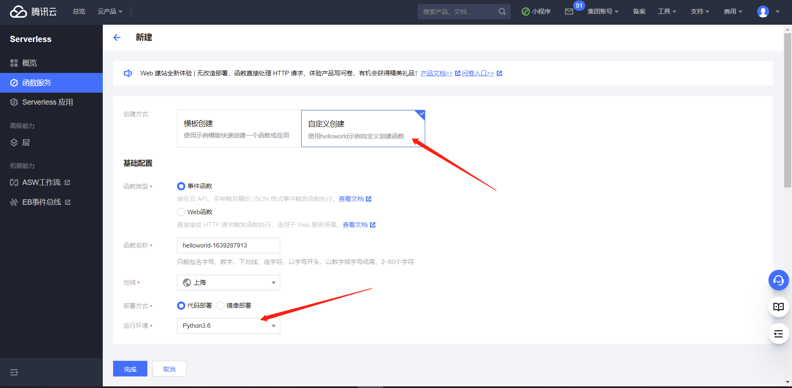
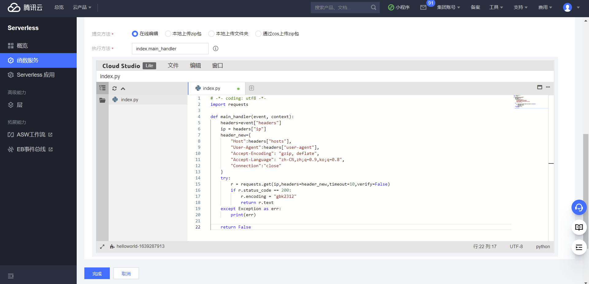
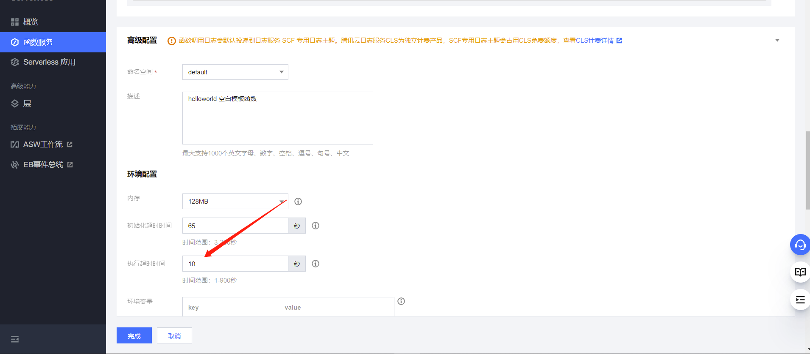
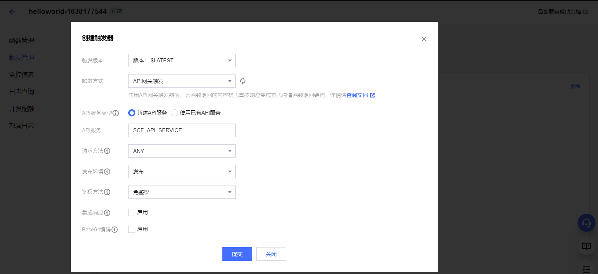
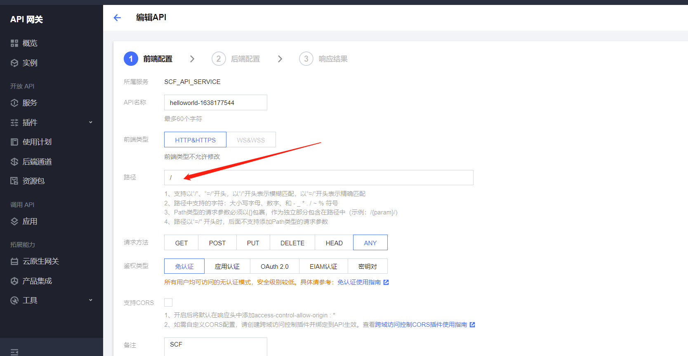
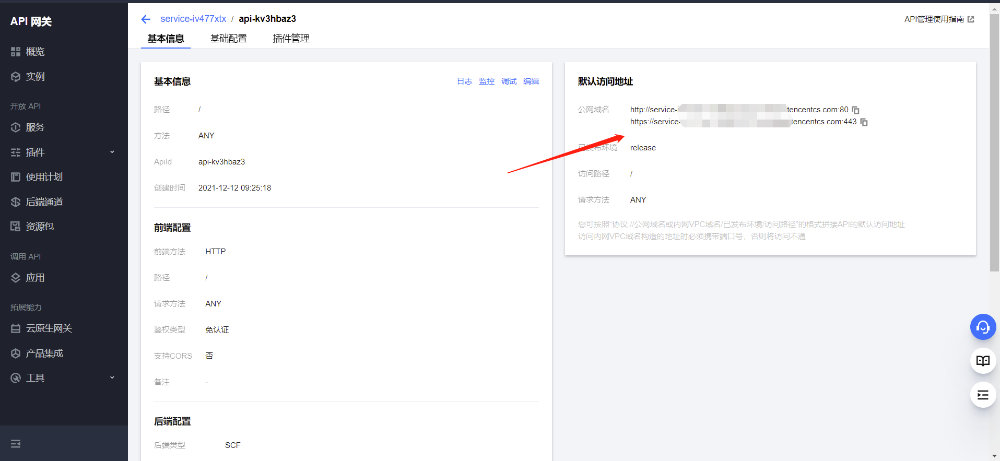
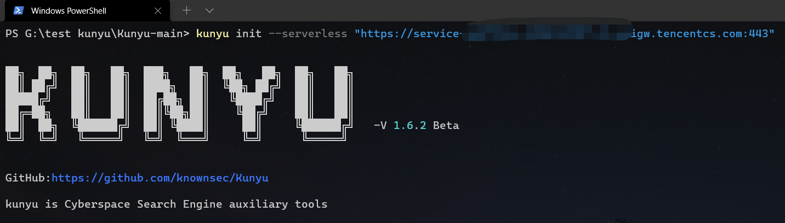
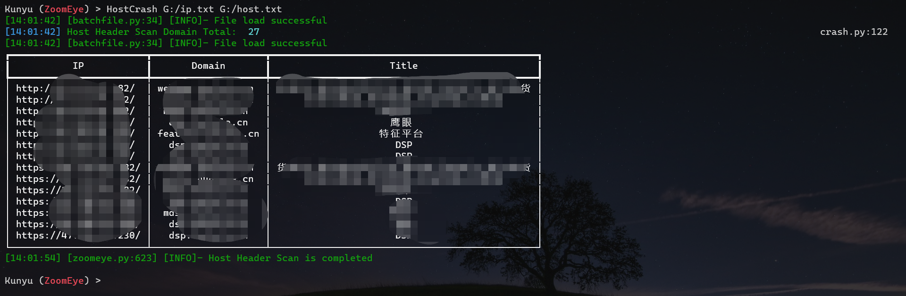

# Kunyu Serverless HOSTS碰撞配置

首先进入配置云函数界面，选择自定义创建，执行环境选为Python3.6，地域都可以，当然针对中国的目标最好选为国内的位置，函数名称任意



填入函数代码，具体代码如下：



```python
# -*- coding: utf8 -*-
import requests

def main_handler(event, context):
    headers=event["headers"]
    ip = headers["ip"]
    header_new={
        "Host":headers["hosts"],
        "User-Agent":headers["user-agent"],
        "Accept-Encoding": "gzip, deflate",
        "Accept-Language": "zh-CN,zh;q=0.9,ko;q=0.8",
        "Connection":"close"
    }
    try:
        r = requests.get(ip,headers=header_new,timeout=10,verify=False)
        if r.status_code == 200:
            r.encoding = "gbk2312"
            return r.text
    except Exception as err:
        print(err)
        
    return False
```

在高级配置中，执行超时时间设置为10秒，如果超时时间默认时较小，可能导致返回失败请求结果。



创建触发器，具体配置如下，注意关闭集成响应。



编辑API配置的路径为/，然后点击立即完成



配置成功后获取到API网关域名如图：



两个任选其一即可，复制出来并进行初始化操作。

**命令：**

```
kunyu init --serverless "API网关地址"
```

然后正常进行HOSTS爆破功能即可。



**示例：**



**态势感知效果：**


